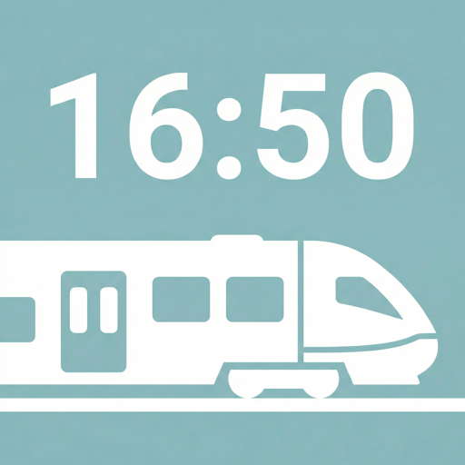
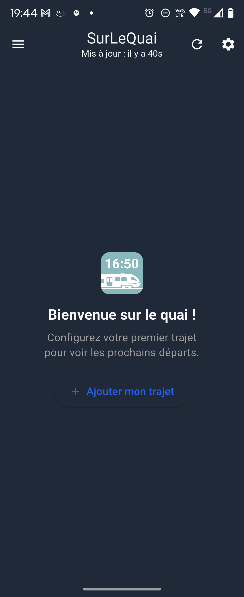
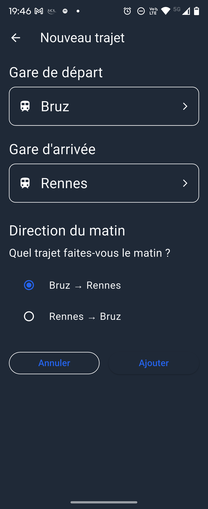
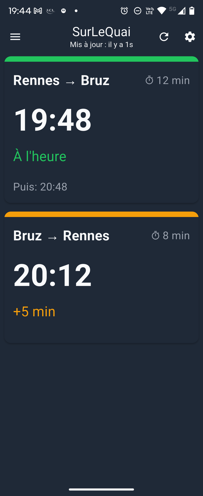
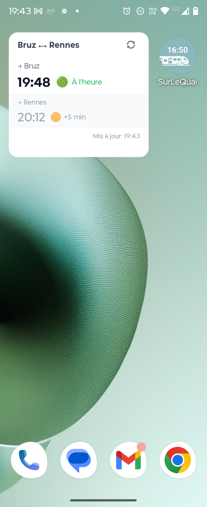

<div align="center">
  
  <h1>SurLeQuai</h1>
  <p><strong>Vos prochains trains, directement sur le quai.</strong></p>
  <p>
    Une application simple, rapide et respectueuse de votre vie privée.
  </p>
</div>

## 📸 Visite guidée

| 1. Bienvenue | 2. Configuration | 3. Vos Trajets | 4. Widget |
|:---:|:---:|:---:|:---:|
|  |  |  |  |

## ✨ Philosophie

SurLeQuai a été conçu en réaction aux applications "usines à gaz". Ici, l'objectif est unique : vous donner l'heure de votre train le plus vite possible.

*   🚫 **Pas de compte** : Vos favoris sont conservés sur votre téléphone.
*   🚫 **Pas de publicité** : Aucune distraction visuelle.
*   🚫 **Pas de traqueur** : Aucun outil de suivi publicitaire.
*   ❤️ **100% Libre** : Code Open Source transparent (Licence MIT).

## 🚀 Fonctionnalités Clés

*   **Temps Réel** : Retards et voies d'affichage en direct (API SNCF).
*   **Widget Natif** : Vos prochains départs sur l'écran d'accueil, sans ouvrir l'app.
*   **Intelligent** : L'ordre des trajets s'inverse automatiquement (Matin/Soir).
*   **Hors-ligne** : Les fiches horaires restent accessibles même sans réseau.

## 🛠 Développement

Utiliser Flutter 3.47 (Dart 3.13) et Java 21 pour Android. Sur macOS avec Homebrew :

```sh
brew install openjdk@21
flutter config --jdk-dir="$(brew --prefix openjdk@21)/libexec/openjdk.jdk/Contents/Home"
flutter pub get
flutter analyze
flutter test
```

Les commandes de génération, de compilation et les particularités des widgets
sont décrites dans [l'architecture technique](docs/ARCHITECTURE.md).

## 📥 Installation

Le projet est Open Source. Vous pouvez compiler le code vous-même ou télécharger les versions prêtes à l'emploi :

*   🤖 **Android** : [APK disponible dans les Releases](../../releases)
*   🍎 **iOS** : Nécessite une compilation manuelle (projet Xcode fourni).

---

<div align="center">
  <a href="docs/ARCHITECTURE.md">Architecture Technique</a> • 
  <a href="docs/privacy-policy.md">Politique de Confidentialité</a>
</div>
